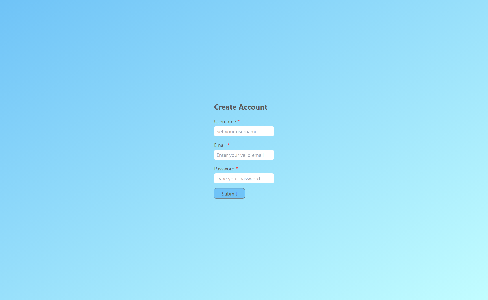
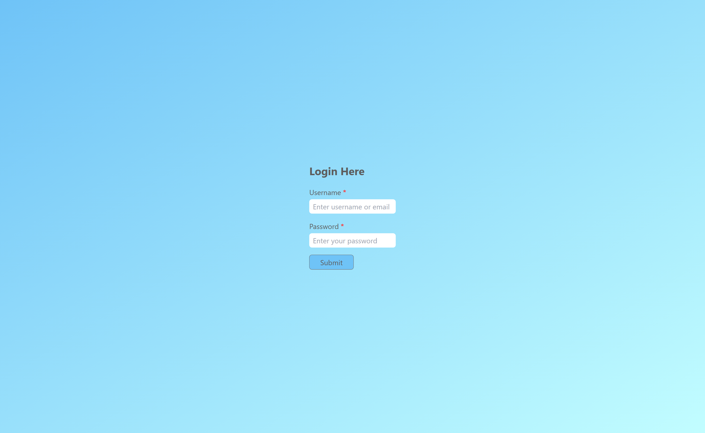

# A6. Login Form : Using LocalStorage and Tailwind

**Login form** is used in emails, news letters, social media accounts and all kind of subscriptions.

## Table of contents

- [Overview](#overview)
  - [Snapshots](#snapshots)
  - [Links](#links)
- [My process](#my-process)
  - [Built with](#built-with)
  - [What I learned](#what-i-learned)
  - [Continued development](#continued-development)
  - [Useful resources](#useful-resources)
- [Author](#author)
- [Acknowledgments](#acknowledgments)

## Overview

In this **Login Form**, first you need to enter your `Username`, `email ID` and `password` in **Create Account** page. When you click on _submit_ button, your data will be saved locally in local storage of your browser.

Also, a new page, **Login Here**, will open.

Here, first you need to enter either `username` or `email ID`. Then your `password`. An **alert** message will inform that your entries are correct or not.

### Snapshots

**Create Account Page :**

**Login Account Page :**

**Create Account Page : After entering data**

### Links

- Solution URL: [Source Code](https://github.com/SoniBasant/Vanilla-JavaScript-Projects/tree/main/A6-Login-form-with-localStorage-Tailwind)
- Live Site URL: [Live Link](https://sonibasant.github.io/Vanilla-JavaScript-Projects/A6-Login-form-with-localStorage-Tailwind/src/index.html)

## My process

### Built with

- Tailwind CSS

- Semantic HTML5 markup
- Vanilla JavaScript
- Flexbox
- Desktop-first workflow

### Concepts Used

- getElementById()

- addEventListener() > click
- .value
- if...else
- Many Tailwind classes > bg-gradient, rounded-md etc.

Some **important** concepts -

- localStorage

- setItem()
- getItem()

### Continued development

Need to work on UI/UX, designs.

Your suggestions are welcome. 🙌

### Useful resources

- [w3schools](https://www.w3schools.com) - This helped me throughout my journey. Still doing. 🙂

- [Udemy](https://www.udemy.com/course/50-projects-50-days/) - On DOM part 🤝
- [freecodecamp](https://www.freecodecamp.org/) - All the problems I solved. Helped me a lot. 🙌

## Author 👨‍💻

- GitHub - [@SoniBasant](https://github.com/SoniBasant)

- Frontend Mentor - [@SoniBasant](https://www.frontendmentor.io/profile/SoniBasant)
- CodePen - [@SoniBasant](https://codepen.io/sonibasant)
- Hashnode - [@SoniBasant](https://sonibasant.hashnode.dev/)

## Acknowledgments

As for the styling and color selection of calculator, I take it from an article/video from _freecodecamp_.
